# Panbrowser Manual v.1.0

---

## Table of Contents

1. General Tipps
2. Installation
3. Abstract
4. Core concept
5. Workflow
---

## 1. General Tipps
   
    
* Use Ctr + Mousewheel for zooming in and out
* Quick workflow for the impatient:
   * Search your gene in "grid"
   * Add a selection of genes to favourites by using the popups
   * Display selected sequences in "favourites"
   * Align your selected sequences in "align"
   

---

## 2. Abstract

With steadily increasing availability of chromosome scale assemblies, new tools are needed for fast comparison of multi-sample datasets. Many of the available genomebrowsers provide excellent insights by displaying detailed high resolution content for single loci in a genome. But due to the complexity of these browser, it is difficult to develop a concept to align pangenomic content based on these established browsers.

Panbrowser uses a simple core concept and only relies on annotated coding sequences (CDS). It was developed for finding novel resistance and effector genes for the plant-pathogen interaction of wheat and wheat-powdery mildew. 

Genomic resource requirements for Panbrowser are multiple full chromosome-scale genome assemblies with a consistent annotation. Once the browser is created, GWAS-peaks can be assessed very quickly and genes close to the peak are harvested and compared in a matter of minutes. Panbrowser is especially usefull to screen for genes which are absent in the reference genome.
    
Today there are two versions of Panbrowser in existence. One version for nine genomes of *Blumeria graminis f.sp. tritici* and a version for the 10 reference genomes of *Triticum aestivum*. At the moment it not (yet?) possible to create your own SQL-database from your genomic files using the core concept. Feel free to contact me if you wish to create a Panbrowser for your organism.

December 2021   
Maintainer: J.P.Graf   
contact: panbrowser/at/caldetas.com

---

## 3. Installation

### 3.1 Prerequisites

* Install Docker https://docs.docker.com/engine/install/ubuntu/
* Install docker-compose
https://docs.docker.com/compose/install/

### 3.2 Set up with precompiled docker image

* Select the desired github precompiled branch

        git pull -b <your_desired_branch> https://github.com/caldetas/panbrowser.git  

        #go into directory
        cd panbrowser
    
        # download and put your SQL-database in db/ folder,
        # filename should be init.sql, ask maintainer for 
        # database file if you do not know where to look..
        # ..atm db is not public until publication of the data..
        
        # start setting up docker containers
        sudo docker-compose up
    
        # SQL-database needs time to set up! once the setup is
        # finished, look in the output for the Panbrowser IP, 
        # --> see image
        
        # optional: stop containers and restart running in background
        CTRL + C 
        docker-compose up -d

        #Visit this IP in your web browser OR
        # visit the localhost adress:
        # blumeria 0.0.0.0:5007
        # triticum 0.0.0.0:5008
   
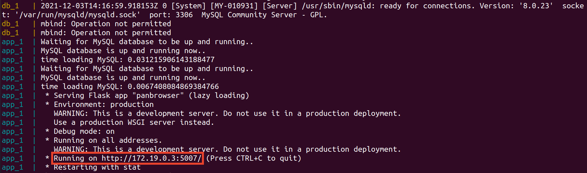

---

## 4. Core Concept

### Define besthits with Blastn

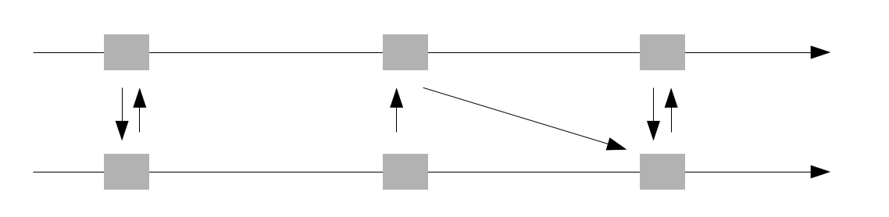
* Every gene is blasted against all other genes of every genome to define the besthit.
* The besthit was defined by:
    1. lowest evalue
    2. highest bitscore

### Define bidirectional besthits

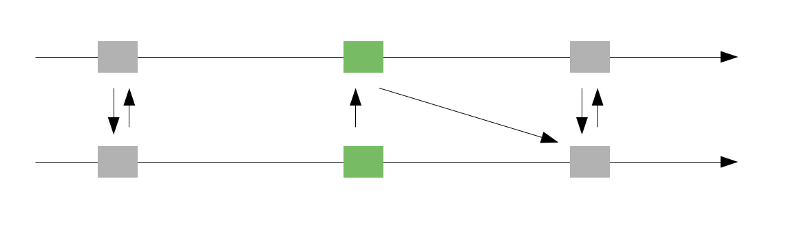
* Bidirectional besthits (grey):
   * Genes with a bidirectional besthit in all(!) other genomes are bidirectional besthits.
   * In the Panbrowser we will also call them backbone genes, as they provide the backbone structure for the Panbrowser.
* Non-bidirectional besthits (green):
   * Missing at least one bidirectional besthit and are discarted as backbone genes, here they will be called non-backbone genes.
   * Genomic regions with low synteny and high diversity are very green in the Panbrowser, these regions are particularly interesting for finding effector and resistance genes.   

### Search where to start

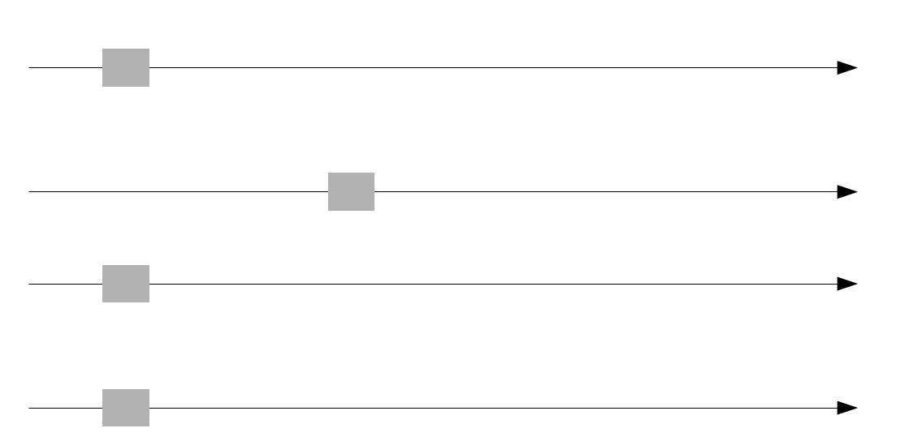
* Bidirectional besthits (grey):
   * The Search allways starts at a backbone gene.
   * Non-backbone gene searches are redirected to the closest backbone gene.
   * This backbone gene is then found in all genomes and will be anchored in the next step.

### Set anchor

* The genomes shift so the bidirectional besthits get aligned vertically.
* The viewing window will be set around this anchor.

### Get upstream genes

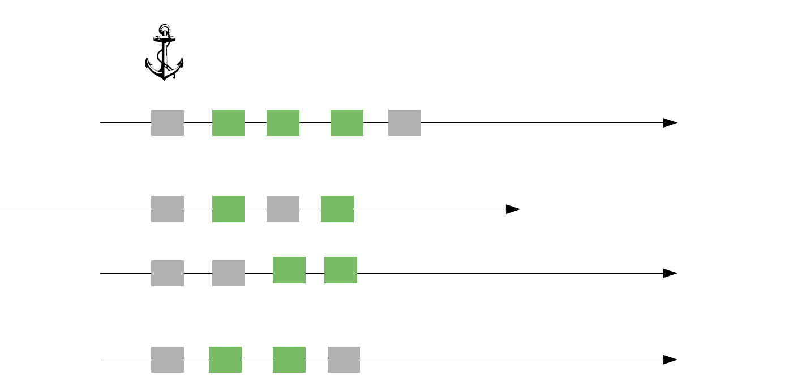
* Here the genes get fetched upstreams of the anchor, in the order they are appearing in the genome.
* The same is done for the genes downstreams, not displayed here.
* The identity of the genes is allready known (backbown genes/non-backbone genes)

### Arrange genes in viewing window

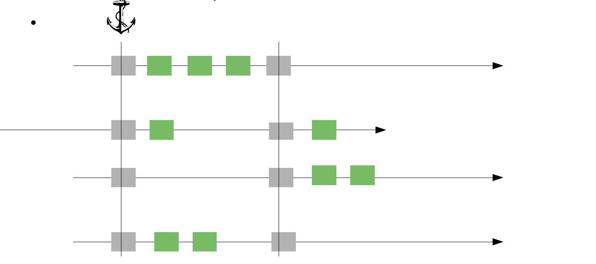
* The genes are arranged according to their color, so that backbone genes allways align vertically.
   * Only the anchored genes are aligned after their besthit identity. In the next step, all other backbone genes will be proofread regarding their vertical neighbours.
* Non-backbone genes are simply  leftaligned in the space between the backbone genes, nothing can be read concerning their vertical neighbours.
   * Remember, only genes with a bidirectional besthit in all(!) other genomes are backbone genes.

### Proofreading backbone genes

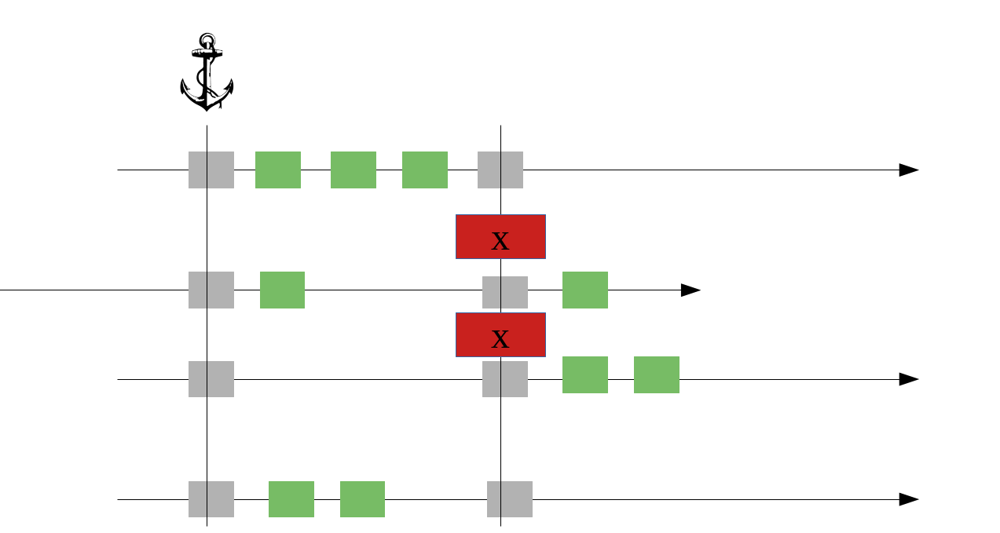
* The last step in the display of gene synteny in Panbrowser is to proofread the neighbouring backbone genes.
* If something is off with the colinearity of the assemblies, the proofreading should make it obvious. Except of course if there are no annotated genes in this region, then the Panbrowser can not catch it.
   

---

## 5. Workflow

### Grid View

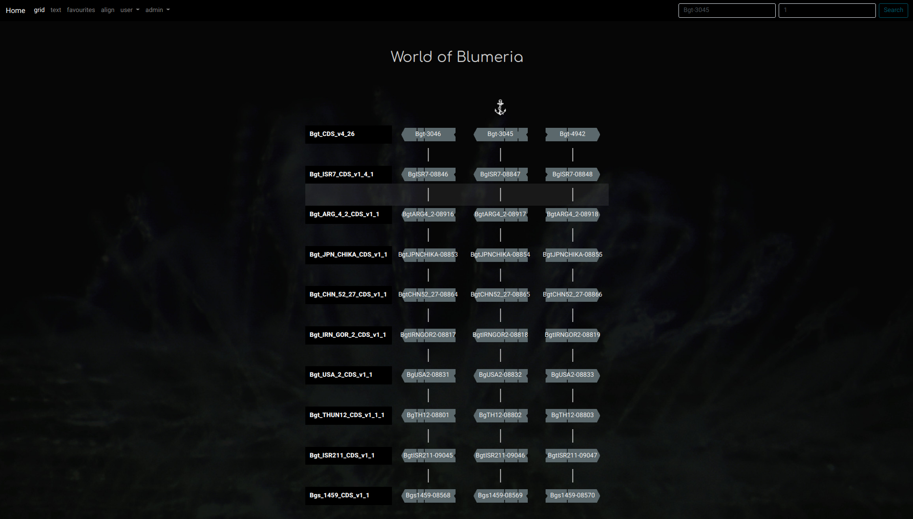
* Search Bars
  * Left search bar: Genename
      * Search for gene of interest, defines where to display the gene synteny.
  * Right search bar: Window Size
      * Integer, defines how many backbone genes are displayed left and right of the anchor. Window size here is 1.
  * The anchor indicates for which backbone gene the bidirectional besthits are aligned.
  * Right search bar: Define window size (int), how many backbone genes are displayed left and right of the anchor. Window size here is 1.   
  

#### Gene info on display 

 
   
* The arrow indicates the orientation of the gene.
   * Left: backward strand
   * Right: forward strand
* The compartments give a quick overview over the exon structure of the gene.   
* The gene Bgt-5525 is on the backwards strand and consists of three exons- and the middle exon is very small.   

#### Popup for more gene info

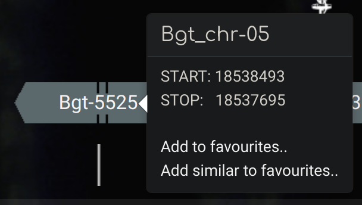
* Displays annotation information:
   * Chromosome
   * Start Position
   * Stop Position
* **Select genes of interest by adding them to favourites.**   
* **Add similar to favorites..** adds all similar genes in the genome  to the selection, similar genes have a blasthit evalue smaller than 1e-6n to the selected gene.
* For triticum:
    * *Add similar to favourites..* is limited to genes of the same chromosome of all subgenomes.
* Clear selection on bottom of the page to delete favourites and restart fresh.   

#### Example of proofreading

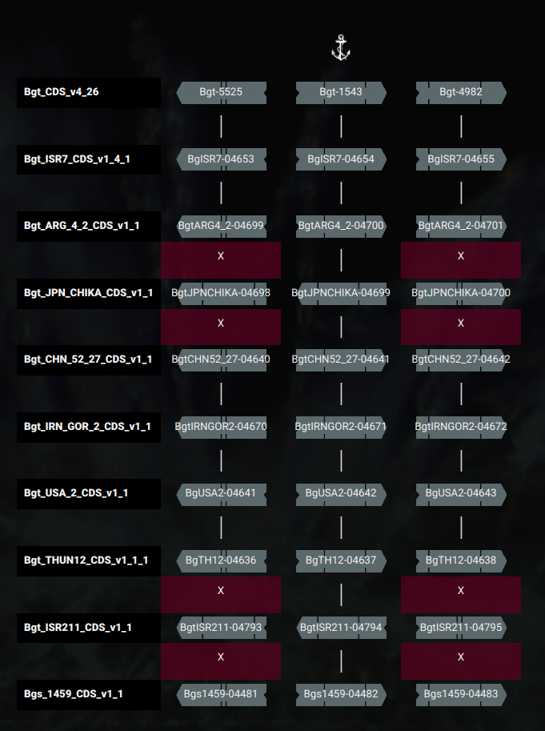
* Only backbone genes on the anchored postions are aligned for bidirectional besthits.
* Other backbone are placed in their respective order in the assembly, proofreading checks if aligned backbone genes are actual bidirectional beshits.
* The red field with the "X" indicateds a missmatch of backbone genes.
* Here two genomes have an inversion at this loci:
   * JPN_CHIKA
   * ISR211
* From the orientation of the anchor genes we can allready see that it is probably an inversion.
* For proof we add all similar genes of Bgt-5525 to favourites.

#### Proofreading shows inversion

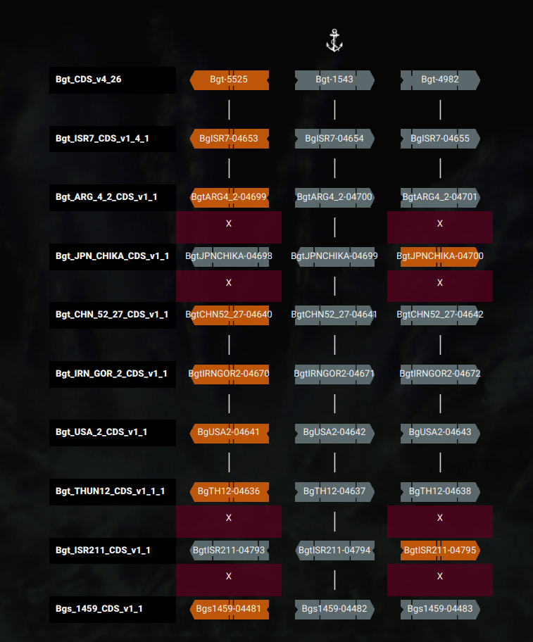

* It definitely looks like a inversion occuring in two genomes.
* To get an idea of the size of the inversion we zoom out (set window size to 5).

#### Proofreading shows it is a local inversion

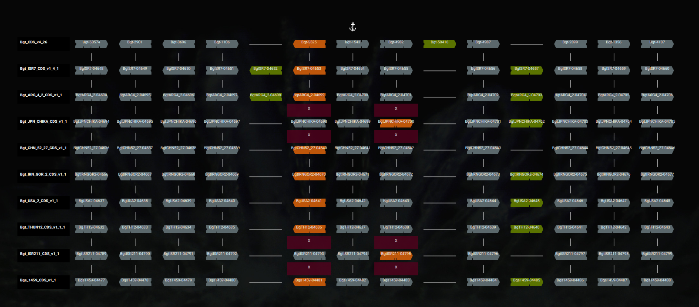
* It is a small, local inversion.
* Three genes annotated on this inversion make the inversion visible in the Panbrowser.

#### Example of a larger inversion

   

* Here a known, larger inversion on the chromosome 2 of in the reference assembly 96224 is shown.
* The plot shows chromosome 2 of 96224 plotted against chromosome 2 of ISR211.
* The inversion is an artifact from wrong scaffolding of the assembly contigs.
* In all other, newer assemblies the missplacement did not happen anymore.

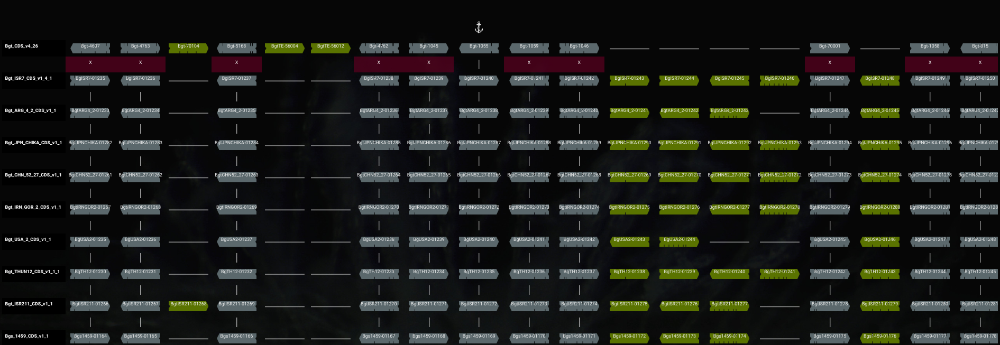

* This is how it looks in the Panbrowser if we zoom in on a gene located on this inversion.
* The whole first line shows mismatching backbone genes, a clear hint that something is wrong with the assemblies.

#### Example of a region with effectors

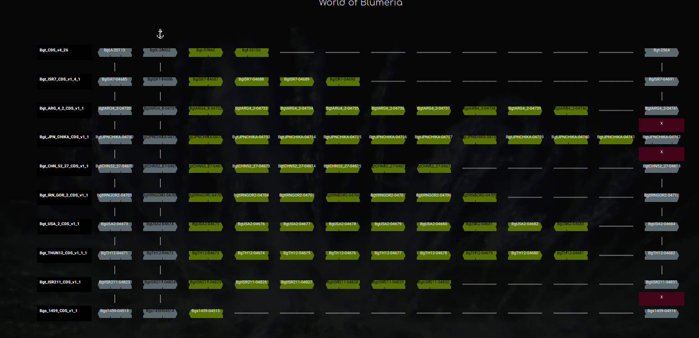

* Like many effector spawning regions, the location of Pm3b displays low synteny and thus high diversity.
   * Panbrowser displays high diversity regions as green content.
   * Non-backbone genes are just leftaligned between the backbone frame, no information can be read from their vertical neighbours.

#### Additional info for Blumeria

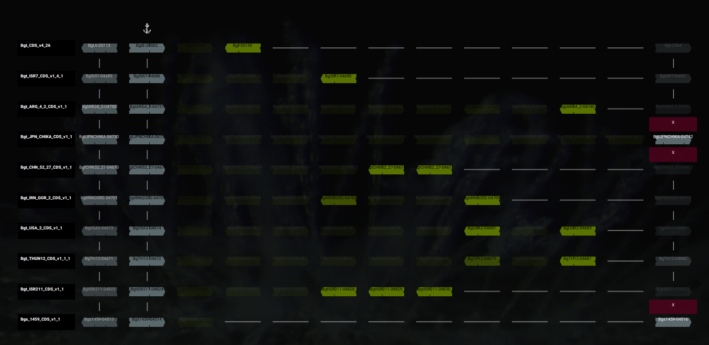

* On the bottom of the page, expression 2 days post infection can be displayed.
   * No expression: transparency.
* The presence of a signal-peptide can be displayed.
   * Signal-peptide present: Genename written in black text.   

### Add genes of interest to favourites
   
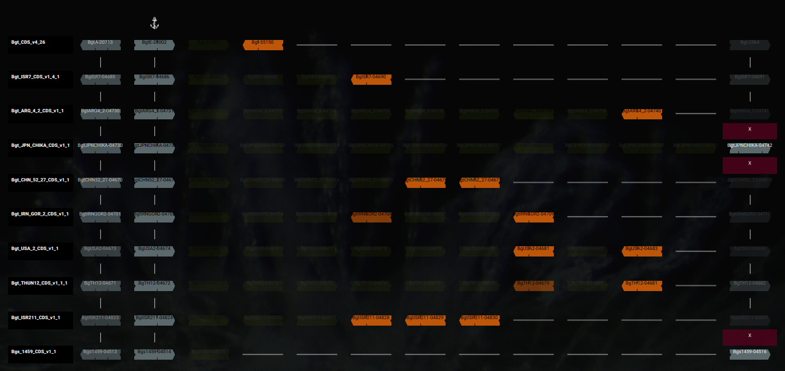

* Example of a selection from a loci.

### Display CDS of selection
   
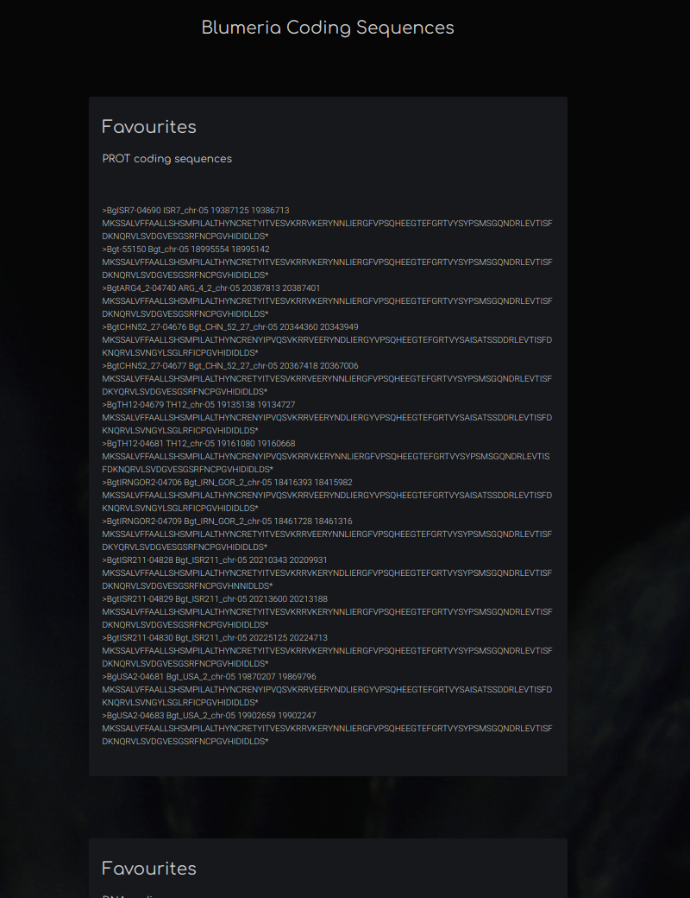

* Choose favourites from top menu bar, two flatfiles are served:
   * genomic flatfile
   * protein flatfile
   
### Align favourites in Jalview
   
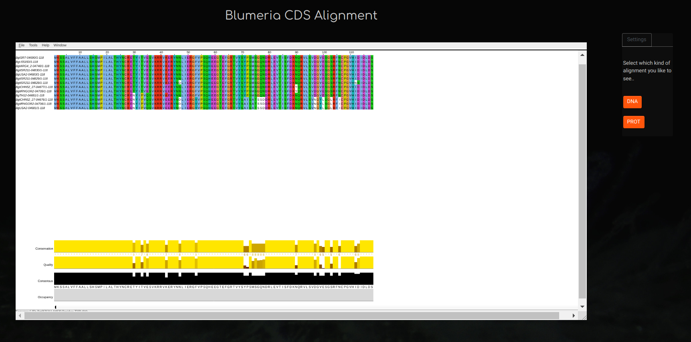

* Jalview has been integrated to align the selected genes.
* Select align from top menu bar.
* Two modes:
   * genomic alignment
   * protein alignment   

### Tipp: Create Trees 
   
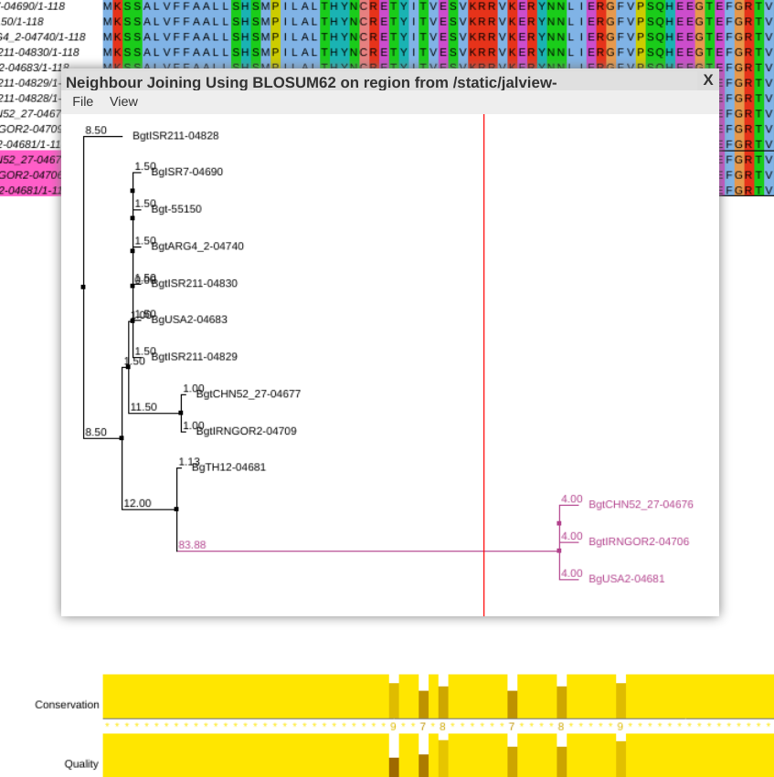

* In Jalview it is easy and fast to create protein phylogeny trees.
* Look for "calculate" in Jalview menu.
    